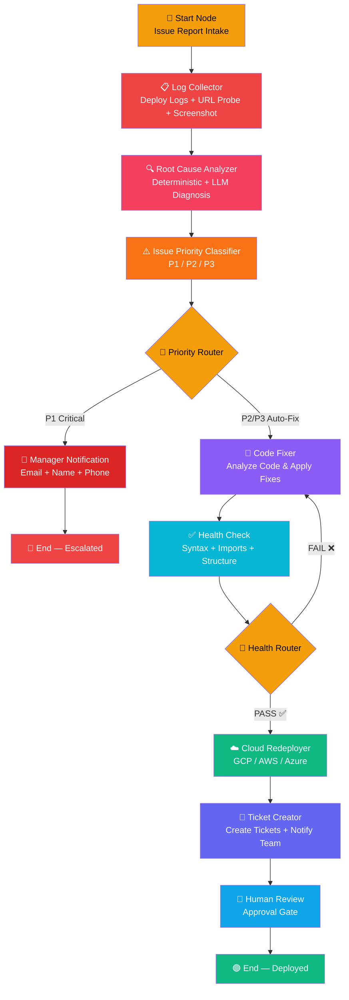

# 🔧 App Issue Resolver — Updated Workflow

## Updated Pipeline Flow



---

## All 14 Nodes — Implementation Status

| # | Node | Enterprise Type | Handler | Status |
|---|------|----------------|---------|--------|
| 1 | 🚀 Start — Issue Report Intake | `start` | Pass-through | ✅ Working |
| 2 | 📋 Log Collector | `selfheal_log_collector` | `_handle_selfheal_log_collector` | ✅ **Enhanced** — 6 data sources |
| 3 | 🔍 Root Cause Analyzer | `selfheal_root_cause` | `_handle_selfheal_root_cause` | ✅ **NEW in flow** — deterministic + LLM |
| 4 | ⚠️ Issue Priority Classifier | `llm_call` | `_handle_llm_call` | ✅ Working — P1/P2/P3 |
| 5 | 🔀 Priority Router | `decision` | `_handle_decision` | ✅ Working — condition node |
| 6 | 📧 P1 Manager Notification | `llm_call` | `_handle_llm_call` | ✅ Working — email composition |
| 7 | 🔧 Code Fixer | `selfheal_code_fixer` | `_handle_selfheal_code_fixer` | ✅ Working — LLM code repair |
| 8 | ✅ Health Check | `selfheal_health_check` | `_handle_selfheal_health_check` | ✅ Working — 7 static checks |
| 9 | 🔀 Health Router | `decision` | `_handle_decision` | ✅ Working — retry loop |
| 10 | ☁️ Cloud Redeployer | `selfheal_redeployer` | `_handle_selfheal_redeployer` | ✅ Working — GCP Cloud Run |
| 11 | 🎫 Ticket Creator | `selfheal_ticket_collector` | `_handle_selfheal_ticket_collector` | ✅ **NEW + Rewritten** |
| 12 | 👤 Human Review Gate | `selfheal_human_in_loop` | `_handle_selfheal_human_in_loop` | ✅ **NEW in flow** |
| 13 | 🔴 End — Escalated | `end` | Built-in | ✅ Working |
| 14 | 🟢 End — Deployed | `end` | Built-in | ✅ Working |

---

## Node Details

### 1. 🚀 Start Node — Issue Report Intake
| Field | Value |
|-------|-------|
| **Type** | Trigger (API Call) |
| **Input** | `app_url`, `issue_description`, `repo_url`, `manager_email`, `manager_name`, `manager_phone`, `cloud_provider`, `cloud_config` |
| **Output** | Normalized payload passed downstream |

### 2. 📋 Log Collector (Enhanced)
| Field | Value |
|-------|-------|
| **Type** | Enterprise (`selfheal_log_collector`) |
| **Data Sources** | 1. Cloud Run runtime logs, 2. Cloud Build logs, 3. Firestore deploy logs, 4. Synthesized agent status, 5. **Live URL probing** (HTTP + API endpoints), 6. **UI screenshot** (Playwright + console errors) |
| **Output** | `error_logs`, `http_status`, `api_responses`, `screenshot`, `url_probe`, `console_errors`, `severity_breakdown`, `agent_code` |

### 3. 🔍 Root Cause Analyzer (NEW)
| Field | Value |
|-------|-------|
| **Type** | Enterprise (`selfheal_root_cause`) |
| **How it works** | 1. **Deterministic pre-diagnosis** — regex pattern matching for ModuleNotFoundError, ImportError, SyntaxError, etc. 2. **LLM analysis** — Gemini reasoning for complex/ambiguous errors. Skips LLM if deterministic match is high-confidence. |
| **Output** | `root_cause`, `error_type`, `severity`, `category`, `affected_lines`, `suggested_fix`, `confidence`, `diagnosis` |

### 4. ⚠️ Issue Priority Classifier
| Field | Value |
|-------|-------|
| **Type** | Enterprise (`llm_call`) |
| **Classification** | P1 = System DOWN/security breach → Escalate, P2/P3 = Broken features/minor bugs → Auto-fix |
| **Output** | `priority`, `issues[]`, `result` (true=escalate), `branch` (escalate/auto_fix) |

### 5. 🔀 Priority Router
| Field | Value |
|-------|-------|
| **Type** | Decision node |
| **Rule** | `result == true` → P1 Manager Notification, `result == false` → Code Fixer |

### 6. 📧 P1 Manager Notification
| Field | Value |
|-------|-------|
| **Type** | Enterprise (`llm_call`) |
| **Input** | Manager email, name, phone from trigger input |
| **Output** | Composed critical alert email with full issue details |

### 7. 🔧 Code Fixer
| Field | Value |
|-------|-------|
| **Type** | Enterprise (`selfheal_code_fixer`) |
| **How it works** | Receives `agent_code` + `root_cause` diagnosis → LLM generates minimal fix → Returns only changed files. Supports dependency-only fixes (just add to requirements.txt). Includes health check retry feedback loop. |
| **Output** | `fixed_code`, `changes_made`, `confidence`, `requirements_additions` |

### 8. ✅ Health Check
| Field | Value |
|-------|-------|
| **Type** | Enterprise (`selfheal_health_check`) |
| **Checks** | 1. Syntax (AST parse), 2. Agent structure, 3. Import audit, 4. Requirements cross-check, 5. Diff check, 6. Size sanity, 7. Confidence gate |
| **Output** | `verdict` (PASS/FAIL), `health_check_passed`, `errors[]` |

### 9. 🔀 Health Router
| Field | Value |
|-------|-------|
| **Type** | Decision node |
| **Rule** | PASS → Redeployer, FAIL → back to Code Fixer (max 2 retries) |

### 10. ☁️ Cloud Redeployer
| Field | Value |
|-------|-------|
| **Type** | Enterprise (`selfheal_redeployer`) |
| **Supports** | GCP (Cloud Run), AWS (ECS/Lambda), Azure (App Service) |
| **Output** | `deployment_status`, `service_url`, `service_name` |

### 11. 🎫 Ticket Creator (NEW + Rewritten)
| Field | Value |
|-------|-------|
| **Type** | Enterprise (`selfheal_ticket_collector`) |
| **Data gathered from** | ALL upstream context: root cause, code fixer changes, deployment result, log collector errors |
| **Output** | Structured tickets with ID, priority, status, assignee + multi-channel notifications (Slack, Email) |

### 12. 👤 Human Review Gate (NEW)
| Field | Value |
|-------|-------|
| **Type** | Enterprise (`selfheal_human_in_loop`) |
| **Behavior** | Pauses for human approval. Auto-approves if health check passed and `auto_approve_if_healthy` is set. Demo mode: auto-approves. |
| **Output** | Decision (approved/auto_approved/skipped) + all upstream data passed through |

---

## Files Modified

| File | Changes |
|------|---------|
| [node_executors.py](file:///d:/Projects/kre_agentic_ai/backend/app/workflow/node_executors.py) | Enhanced log collector, rewritten ticket collector, updated `_SELFHEAL_TYPES` sets |
| [workflow_engine.py](file:///d:/Projects/kre_agentic_ai/backend/app/workflow/workflow_engine.py) | Updated `_SELFHEAL_ENTERPRISE_TYPES` set |
| [app_issue_resolver_workflow.json](file:///d:/Projects/kre_agentic_ai/backend/data/workflows/app_issue_resolver_workflow.json) | Added 3 new nodes + updated edges |
| [app_issue_resolver_pipeline.json](file:///d:/Projects/kre_agentic_ai/backend/data/workflows/app_issue_resolver_pipeline.json) | Added 3 new nodes + updated edges + positions |
| [ai_suggest_router.py](file:///d:/Projects/kre_agentic_ai/backend/api/ai_suggest_router.py) | Added 2 catalog entries + updated log collector |

---

## Execution Input Example

```json
{
  "trigger_input": {
    "app_url": "https://my-app.example.com",
    "issue_description": "Users are getting 500 errors on the checkout page.",
    "repo_url": "https://github.com/myorg/my-app",
    "manager_email": "john.doe@company.com",
    "manager_name": "John Doe",
    "manager_phone": "+1-555-0123",
    "cloud_provider": "gcp",
    "cloud_config": {
      "project_id": "my-gcp-project",
      "region": "us-central1",
      "service_name": "my-app-service"
    }
  }
}
```
